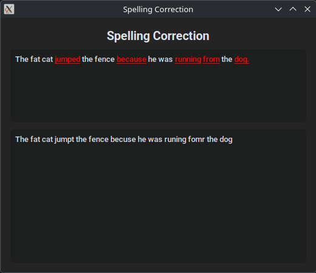

# Spelling Correction AI
A fine-tuned Qwen3 model for spelling correction that uses sentence context to identify and correct misspelled words.



## Install
```
pip install -r requirements.txt
NVCC_THREADS=1 python -m pip install flash-attn --no-build-isolation -v
```
